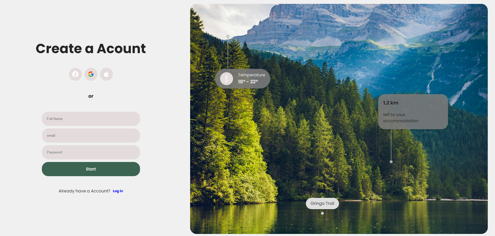

# React Vite Login Page

A simple login page built with React and Vite. This project includes a basic form, styled components, and icon usage with the `react-icons` library.


## Live Demo

Check out the live version of the login page here:

[Vercel Deployment Link](https://login-three-ebon.vercel.app)

## Features

- Responsive login page design.
- Custom input components for user login information.
- `react-icons` library for easy icon integration.
- Easy to set up with Vite for a fast development environment.

## Setup

### Prerequisites

Make sure you have the following installed:

- [Node.js](https://nodejs.org/) (LTS version recommended)
- [npm](https://www.npmjs.com/) or [yarn](https://yarnpkg.com/)

### Installation

1. **Clone the repository:**

   ```bash
   git clone https://github.com/crowtek/login.git

   ```

2. **Navigate into the project directory:**

   ```bash
   cd your-project-name

   ```

3. **Install dependencies:**

   ```bash
   npm install

   ```

4. **Install dependencies:**

   ```bash
   npm install react-icons react-hook-form

   ```
